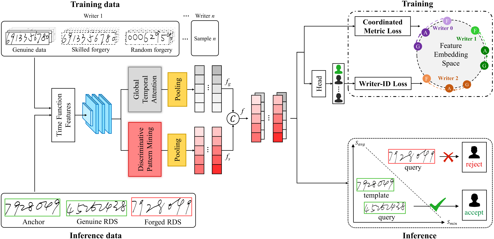

# <div align="center">:shield:PAVENet

<div align="center">
  <a href="http://dlvc-lab.net/lianwen/"> </a>
  <a href="https://ieeexplore.ieee.org/document/10840296"> </a>
  </a>
  <a href="./LICENSE"> </a>
<p></p>

<a href="https://ieeexplore.ieee.org/document/10840296"> <b>Privacy-Preserving Biometric Verification with
Handwritten Random Digit String</b> </a>

<b>IEEE Transactions on Pattern Analysis and Machine Intelligence (TPAMI), 2025</b>

:star:Official code of the PAVENet model and the release of the HRDS4BV dataset.​
</div>

## <div align="center">:ocean:Introduction</div>

This paper proposes using Random Digit String (RDS) for privacy-preserving handwriting verification. Users can perform identity authentication by writing a digit sequence of arbitrary content rather than signing signatures that contains personal information, effectively protecting privacy.

To this end, we first propose the **HRDS4BV** dataset, consisting of handwritten RDS acquiring from 402 writers. Second, we propose the Pattern Attentive VErification Network (**PAVENet**) to extract discriminative handwriting patterns, enhancing writing style representation.



<div align="center"><i>The framework of PAVENet</i></div>

## <div align="center">:scroll:HRDS4BV Dataset</div>

### Description

HRDS4BV dataset is a handwriting verification benchmark dataset that contains 16080 RDS samples from 402 users, with 20 genuine samples and 20 skilled forgeries per user. Each RDS is composed of random digits in a length of 7~11. The dataset is acquired in two separate sessions, in which 10 genuine samples and 10 skilled forgeries per user are collected in each session. More details are presented in the below table.

| Content             | Length | Modality | Session | User | Genuine Sample              | Skilled Forgery             | Features    |
| ------------------- | ------ | :------: | ------- | ---- | --------------------------- | --------------------------- | ----------- |
| Random Digit String | 7~11   |  Online  | 2       | 402  | $402\times(10 + 10) = 8040$ | $402\times(10 + 10) = 8040$ | $X,Y,P,T,U$ |

$X,Y,P,T,U$ respectively denote the $x$ coordinates, y$ coordinates, pressure, timestamps, and the pen-up/pen-down information. The pen-down/pen-up information is represented by 0~3. 0 indicates that this is not a pen-up/pen-down point. 1 indicates that this is a pen-down point. 2 indicates that this is a pen-up point. 3 indicates that this point is both a pen-up and pen-down point, which is isolated.

### Dataset Accessibility

You can access the dataset following the instructions:

- The HRDS4BV dataset can only be used for non-commercial research purposes. For scholar or organization who wants to use the HRDS4BV dataset, please first fill in this [Application Form](./application-form/Application-Form-for-Using-MSDS.docx) and sign the [Legal Commitment](./application-form/Legal-Commitment.docx) and email them to us. When submitting the application form to us, please list or attached 1-2 of your publications in the recent 6 years to indicate that you (or your team) do research in the related research fields of handwriting verification, handwriting analysis and recognition, document image processing, and so on. 
- We will give you the download link and the decompression password after your application has been received and approved.
- All users must follow all use conditions; otherwise, the authorization will be revoked.

### Data Format

The dataset is organized in the following directory format:

```bash
HRDS4BV
├─session1
│  ├─0
│  │  ├─f_0_0.txt
│  │  ├─f_0_1.txt
│  │  ├─...
│  │  ├─g_0_0.txt
│  │  ├─g_0_1.txt
│  │  └─...
│  ├─1
│  │  ├─f_0_0.txt
│  │  ├─f_0_1.txt
│  │  ├─...
│  │  ├─g_0_0.txt
│  │  ├─g_0_1.txt
│  │  └─...
│  ├─...
├─session2
│  ├─...
```

- Data of two sessions is stored in `session1` and `session2`.
- The users are arranged from `0` to `401`, with online dynamic time series and offline static images provided in `series` and `images`. The time series are saved as `.txt` files and the images are in `.png` format.
- The naming of each file follows the same format: `flag_user_index`.
- - `flag` is `f` or `g`. `f` indicates that this file is a skilled forgery, while `g` indicates that it is a genuine sample.
- - `user` indicates the number of user of this file.
- - `index` indicates the number of this file in the current folder.
- - For example, `f_0_0.txt` represents the first file (time series) of all skilled forgeries of the user `0`.

### Data License

HRDS4BV should be used and distributed under [Creative Attribution-NonCommercial-NoDerivatives 4.0 International (CC BY-NC-ND 4.0) License](https://creativecommons.org/licenses/by-nc-nd/4.0/) for non-commercial research purposes.

## <div align="center">:earth_asia:Environment</div>

```bash
git clone https://github.com/SCUT-DLVCLab/PAVENet.git
cd PAVENet
conda create -n pavenet python=3.8.16
conda activate pavenet
pip install -r requirements.txt
```

## <div align="center">:hammer_and_pick:Data Preparation</div>

Download the HRDS4BV dataset and unzip it using the following commands (`7z` is recommended for the unzipping; please ensure that `7z` is installed and available):

```bash
mkdir data
7z x HRDS4BV.zip -odata
```

You can enter the decompression password here.

Run `process.py` for data preprocessing and data splitting:

```bash
python process.py
```

Now the data should be all preprocessed and splitted. The final data directory should look like:

```bash
data
├── HRDS4BV
├── hrds4bv-across-test.pkl
└── hrds4bv-across-train.pkl
```

## <div align="center">:rocket:Test</div>

```
python test.py --weights weights/model.pth
```

## <div align="center">:bookmark_tabs:Citation</div>

```bibtex
@ARTICLE{pavenet2025zhang,
  author={Zhang, Peirong and Liu, Yuliang and Lai, Songxuan and Li, Hongliang and Jin, Lianwen},
  journal={IEEE Transactions on Pattern Analysis and Machine Intelligence (TPAMI)}, 
  title={{Privacy-Preserving Biometric Verification With Handwritten Random Digit String}}, 
  year={2025},
  volume={},
  number={},
  pages={1-18},
}
```

## <div align="center">:phone:Cotact</div>

Peirong Zhang: eeprzhang@mail.scut.edu.cn

## <div align="center">:palm_tree:Copyright</div>

Copyright 2025, Deep Learning and Vision Computing (DLVC) Lab, South China China University of Technology.

